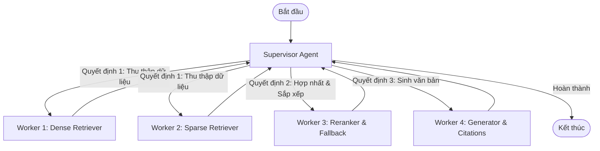

# Assignment Day 09: Supervisor-Workers Multi-Agent RAG System

**Học viên:** Trần Quốc Khánh  
**Mã học viên:** 2A202600679  
**Mô hình thiết kế:** Supervisor - Workers Pattern  

---

## 1. Ý tưởng thiết kế

Để cải tiến hệ thống RAG nguyên khối (monolithic) của Day 8, tôi đã tổ chức lại thành mô hình **Supervisor - Workers** sử dụng **LangGraph**:



- **Supervisor (Bộ điều phối)**: Nhận câu hỏi, kiểm tra trạng thái của `State` để ra quyết định cử Worker nào thực thi. Supervisor kiểm soát luồng điều phối một cách chặt chẽ.
- **Worker 1: Dense Retriever (Tra cứu ngữ nghĩa)**: Kết nối với Weaviate Vector DB để tìm các chunks có độ tương đồng ngữ nghĩa cao.
- **Worker 2: Sparse Retriever (Tra cứu từ khóa)**: Sử dụng thuật toán BM25 để tìm các chunks khớp từ khóa chính xác (rất quan trọng với số Điều/Khoản luật).
- **Worker 3: Reranker & Fallback (Xếp hạng & Dự phòng)**: Tiến hành gộp kết quả từ 2 worker trước bằng RRF, boost điểm cho các từ khóa pháp lý hoặc số điều cụ thể, thực hiện Jina/MMR Reranking. Nếu điểm số tốt nhất dưới 0.3, worker này tự động kích hoạt chế độ dự phòng gọi PageIndex Vectorless Search.
- **Worker 4: Generator & Citations (Sinh văn bản)**: Nhận tài liệu đã lọc, sắp xếp lại để tránh hiện tượng "lost in the middle", sau đó sử dụng LLM sinh câu trả lời tiếng Việt chi tiết kèm theo các nguồn trích dẫn đúng quy chuẩn.

---

## 2. Cấu trúc thư mục `Lab_Assignment/`

- `multi_agent_rag.py`: Định nghĩa `State`, Supervisor Node, các Worker Nodes và xây dựng, biên dịch LangGraph Workflow.
- `main.py`: Entrypoint để khởi chạy thử nghiệm truy vấn pháp lý và in log dấu vết hoạt động của Supervisor và các Workers.

---

## 3. Cách chạy thử nghiệm

Di chuyển vào thư mục dự án và chạy:
```powershell
a:\AIK20_aithucchien\Batch02-Day9_Multi-Agent_MCP-A2A\.venv\Scripts\python.exe Lab_Assignment/main.py
```
*(Yêu cầu file `.env` chứa đầy đủ cấu hình kết nối Weaviate và OpenRouter/Nvidia NIM API Key)*
